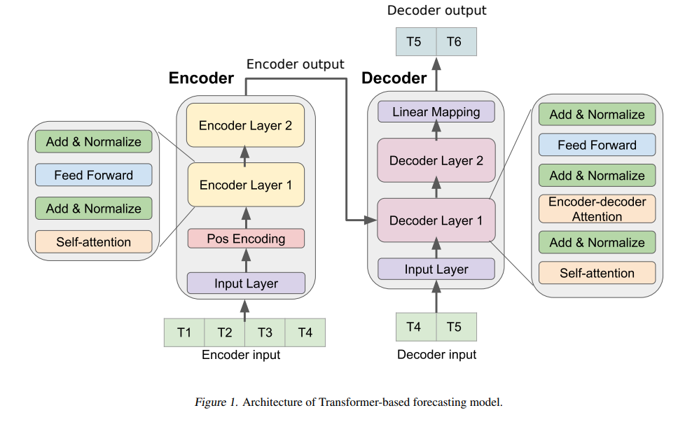
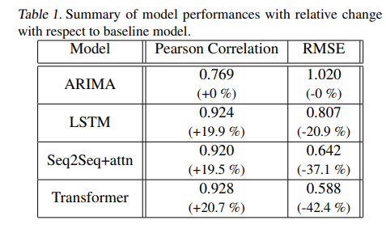

# Transformers-Paper
Repo for the Paper presentation on Transformers.

## Overview
**Time Series Forecasting**

* A variable that depends on time: stock price / day, number of hamburgers you eat / month,influenza cases / week.

* General nature of the problem: If you have past N datapoints, what's the next value going to be?
  * (hamburger_january, hamburger_february, hamburger_march) -> hamburger_april.

* Extremely common problem _(bread & butter of Wallstreet)_ and hosts of methods from different fields
  * AR (AutoRegression): Linear regression
  * ARMA (AR w/ Moving Average): Fancy Linear Regression #1
  * ARIMA (AR Integrated w/ MA ): Fancy Linear Regression #2
  * Exponential smoothing: Fancy Linear Regression #3
  * LSTMs etc.

**Motivating Question**

* Can you use Transformers for this?
  * Do Transformers even work with continuous data?
  * Does this problem require Transformers at all? AKA will you get better results?
  * What kind of Architecture?

### Introduction
**Problem Statement:** Predict ILIs (Influenza-Like Illness) in the future (Why?) using Transformers.

**Data:**  Weekly Country and State level ILI Ratio (influenza/total) published by CDC from 2010 to 2018

**Architecture**

Original Transformer (Encoder-Decoder) based architecture (Vaswani et al., 2017) with suitable modifications. [The algorithm can be found here.](Algorithm%20for%20Time%20Series%20Forecasting.pdf)

Compare this with the [original decoder algorithm here](EDoriginal.png).

Some points to consider:
* Inputs / Outputs are scalars (they also try multi-variate experiment).
* Surprisingly, most of the architecture remains unchanged (I would've guessed differently).

**Question1** 

What, in your opinion, is the most striking difference here?

## Experiment
* Four encoder/decoder layers. Most of the other hyperparameters assumed to be default.
* Positional embeddings sine/cosine.
* Encoder Input is of the form (T1, T2, ..., T10)
* Decoder Input is of the form (T10, T11, ... T13)
* Prediction is made on (T11, ... T14)
* Minibatch size 64
* Adam Optimizer.
* Dropouts for all encoder/decoder layers with d=0.2
* 

## Results (for one-step-ahead forecasting)

Transformer performs better w.r.t baselines? But, for the state of the art (the-then) ARGONet, RMSE is slightly degraded (0.55 vs 0.59)

**Question 2**
* LSTM's pearson correlation is pretty good but RMSE, not so much. What do you think this implies?

## Analysis
* Do we really need ED for this? This looks like a Decoder only Transformer.
* The entire point of embeddings is to compress N dimensional one-hot vectors to n<<N dimensional dense vectors. Aren't these already dense? Do we really need embeddings?
* 

